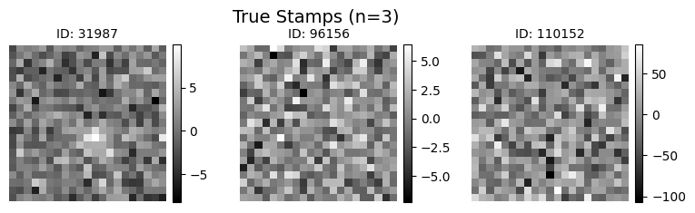
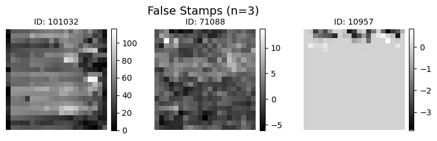
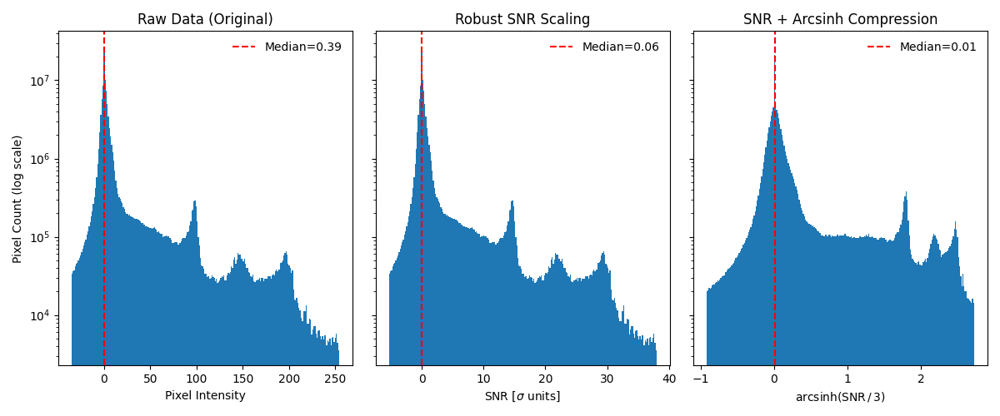
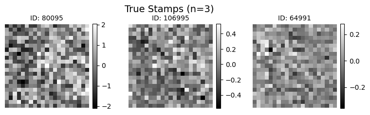
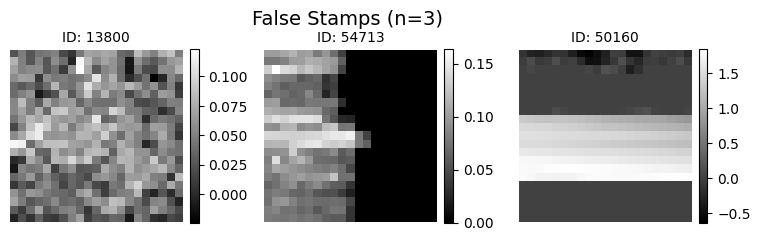
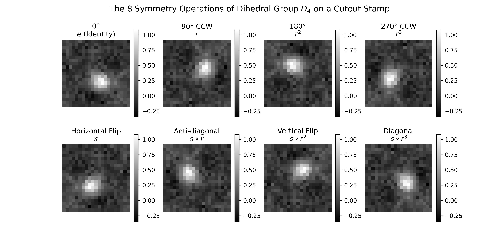

# KBMOD-StampNet

_Classifying asteroids below the detection limit of a single image: filtering KBMOD false positives with Convolutional Neural Networks._

> This project was developed as part of the **Astroinformatics (AS4501)** course at the **University of Chile**.

**Authors:**

- (@jurados) **Steve Jurado** (_Main Contributor_), Universidad de Chile, Chile.
- (@Renato-98) **Renato Pino**, Universidad de Chile, Chile.
- **Korinna Bayer**

**Advisor:** Prof. **Andrew Connolly**, University of Washington, USA.

## Introduction

Kernel-Based Moving Object Detection ([KBMOD](https://github.com/dirac-institute/kbmod); Whidden et al., 2019; Smotherman et al., 2021; Smotherman, 2022) is a GPU-accelerated _shift-and-stack_ (digital tracking) algorithm. It finds faint Solar System bodies, such as Trans-Neptunian Objects (TNOs), that are too dim to see in a single exposure. KBMOD searches a large grid of linear trajectories through a stack of difference images in $\mathcal{O}(10)$ minutes per stack of CCDs.

The search is based on maximum-likelihood detection. We assume the signal of most candidates is dominated by background noise that is independent in each pixel. Under that assumption, the likelihood of a point source moving along a trajectory is the sum, along the trajectory, of two images:

- $\Psi$: the inverse-variance weighted cross-correlation of the PSF with the data.
- $\Phi$: the effective area of the PSF, weighted by the inverse variance.

The detection significance is then

$$\nu = \frac{\sum_i \Psi_i}{\sqrt{\sum_i \Phi_i}},$$

and trajectories with $\nu$ above some threshold $m$ are kept as $m$-sigma detections (Whidden et al., 2019). For each candidate, KBMOD coadds the pixels along the trajectory, so a real object's signal adds up coherently while the noise averages down.

The drawback is that real objects are **rare**, and the searches are contaminated by many **false positives**: ghosts, glints, artifacts, bad subtraction residuals and noise fluctuations that happen to line up. Vetting the candidates by eye does not scale, so we need an automatic filter.

## Objective

Identify the rare asteroids among the false positives using **a single coadded image** of a faint asteroid. We train and compare several CNNs that classify KBMOD coadded stamps (postage-stamp cutouts centred on each candidate trajectory) as **true positives** (real moving sources) or **false positives**. The long-term goal is to go from a single image to stacks of images where the asteroids are very faint.





## Dataset

The data come from the DECam Ecliptic Exploration Project (DEEP; Trilling et al., 2024; Smotherman et al., 2024) and were prepared for the KBMOD ML effort:

- **True Positives:** synthetic objects injected into the DEEP images (P. Bernardinelli) and cut out from the survey data (S. Stetzler).
- **False Positives:** KBMOD run on DEEP with search angles roughly **perpendicular to the ecliptic**. Real objects move along the ecliptic, so almost every result from this search is spurious.

Each source is coadded from a random subset of its observations, with a minimum of 25 observations per coadd. Each stamp is a $21 \times 21$ pixel cutout. Three types of coadd are available (median, mean, sum), and we use the **median coadd** because it is the most robust to outliers. Every split is roughly balanced (about 50:50), for a total of 342,200 single-channel stamps.

| Split      | True Positives | False Positives |   Total |
| ---------- | -------------: | --------------: | ------: |
| Train      |        129,010 |         110,530 | 239,540 |
| Validation |         36,860 |          31,580 |  68,440 |
| Test       |         18,430 |          15,790 |  34,220 |

## Methodology

### 1. Normalization: Robust SNR scaling + `arcsinh` stretch

Astronomical coadd cutouts span a very wide dynamic range:

- **Background pedestal:** most pixels are Gaussian sky fluctuations centred near zero.
- **Heavy tails:** bright stars, cosmic rays and injected sources produce values orders of magnitude above the noise level.

If the network sees these raw values, the few extreme pixels dominate the gradients and make training unstable. We compare three representations:

1. **Raw data:** unscaled pixel intensities, shown between the 1st and 99th percentiles ($p_1$, $p_{99}$).

2. **Robust SNR scaling (sigma clipping):** we estimate the background median $\tilde{\mu}_{\text{bg}}$ and dispersion $\sigma_{\text{bg}}$ with iterative $3\sigma$ clipping (`astropy.stats.sigma_clipped_stats`). This puts every pixel in units of signal-to-noise ratio:

$$x_{\text{SNR}} = \frac{x - \tilde{\mu}\_{\text{bg}}}{\sigma\_{\text{bg}}}$$

After this step the sky background is centred at zero with unit variance ($\sigma \approx 1$). Clipping keeps bright sources from biasing the noise estimate. On the training set we find $\tilde{\mu}\_{\text{bg}} \approx 0.00$ and $\sigma\_{\text{bg}} \approx 6.69$.

3. **SNR + `arcsinh` compression (adopted):** we apply the inverse hyperbolic sine stretch of Lupton et al. (1999), with softening parameter $\beta$:

$$x_{\text{norm}} = \operatorname{arcsinh}\left(\frac{x_{\text{SNR}}}{\beta}\right), \qquad \beta = 5$$

The transform behaves differently in two regimes:

$$\text{arcsinh}(u) \approx \begin{cases} u, & |u| \ll 1 \quad \text{(linear: noise preserved)} \\ \text{sign}(u)\,\ln(2|u|), & |u| \gg 1 \quad \text{(logarithmic: bright flux compressed)} \end{cases}$$

It keeps the faint wings and noise structure linear, which is where faint KBOs sit. It compresses bright sources logarithmically without hard clipping, and unlike $\log x$ it handles negative values from background subtraction. The result is bounded, well-behaved inputs for gradient-based optimisation.
s






### 2. Data augmentation: the dihedral group $D_4$

Deep-HiTS (Cabrera-Vives et al., 2017) made its transient classifier rotation-invariant with the four rotations $\{0^\circ, 90^\circ, 180^\circ, 270^\circ\}$, i.e. the cyclic group $C_4$. Rotations alone do not cover every symmetry of the pixel grid: they miss the reflections. We therefore extend the augmentation to the full dihedral group.

A moving object's stamp has no preferred orientation on the sky. An object moving "up-left" should get the same label as one moving "down-right". The classifier should therefore be **invariant to the symmetries of the square pixel grid**, and these form the **dihedral group $D_4$** of order 8:

$$D_4 = \langle\, r, s \mid r^4 = s^2 = e,\; srs = r^{-1} \,\rangle = \{\, e,\ r,\ r^2,\ r^3,\ s,\ sr,\ sr^2,\ sr^3 \,\}$$

where $r$ is a $90^\circ$ rotation about the stamp centre and $s$ is a reflection (flip). The eight elements are:

| Element         | Transformation                                    |
| --------------- | ------------------------------------------------- |
| $e$             | Identity                                          |
| $r,\ r^2,\ r^3$ | Rotations by $90^\circ$, $180^\circ$, $270^\circ$ |
| $s,\ sr^2$      | Horizontal and vertical reflections               |
| $sr,\ sr^3$     | Reflections across the two diagonals              |

These operations only permute pixels of the $21\times21$ grid. There is no interpolation, so the noise statistics and the PSF are left exactly as they were. This is an advantage over arbitrary-angle rotations.

**Why on the fly?** Our first approach precomputed all 8 transformations of every stamp. That multiplies the dataset by 8, to 1,916,320 coadd images, and even a subset of $n = 1000$ training stamps took about 40 minutes to train. So instead we apply the transformations **on the fly on the GPU** (`GPUDataAugmentation` module), following Dieleman et al. (2015):

1. Draw $k \sim \mathcal{U}\{0,1,2,3\}$ and rotate by $k \times 90^\circ$ (`torch.rot90`).
2. Apply a horizontal flip with probability $p = 0.5$.
3. Apply a vertical flip with probability $p = 0.5$.

A horizontal flip followed by a vertical flip equals $r^2$, and $k$ is uniform. So this procedure samples **all 8 elements of $D_4$ with equal probability** $1/8$. Augmentation is active only during training (`self.training`) and is turned off for validation and test.



### 3. Models

All models are trained with the same pipeline, written in **PyTorch Lightning** (`StampClassifier`), and take a single-channel input of shape $(1, 21, 21)$ (the normalised median coadd).

| Loss function             | Optimizer | Batch size | Learning rate |
| ------------------------- | --------- | ---------: | ------------: |
| Categorical cross-entropy | Adam      |        512 |     $10^{-4}$ |

#### Model V0: Basic CNN

A lightweight baseline (~42k parameters):

```
Conv2d(1→8, 3×3) → BatchNorm → ReLU → MaxPool(2×2) → Dropout(0.25)
→ Flatten → Linear(648→64) → ReLU → Dropout(0.5) → Linear(64→2)
```

#### Model V1: ResNet-56 (CIFAR-style, trained from scratch)

A deep residual network (He et al., 2016) built for small images. Its **residual blocks** learn $\mathcal{F}(x) + x$, and the identity shortcuts let gradients flow through a very deep network:

- Initial $3\times3$ convolution with 16 filters.
- Three stages of $n = 9$ residual blocks each (2 convolutions per block):
  - Stage 1: 16 channels, $21 \times 21$
  - Stage 2: 32 channels, $11 \times 11$ (stride 2)
  - Stage 3: 64 channels, $6 \times 6$ (stride 2)
- Global average pooling followed by a fully connected layer.

$$\text{Depth} = 6n + 2 = 6(9) + 2 = 56 \text{ layers}$$

#### Model V2: ResNet-50 (ImageNet pre-trained, transfer learning)

The torchvision `resnet50` with ImageNet weights. It uses **Bottleneck** blocks ($1\times1 \rightarrow 3\times3 \rightarrow 1\times1$) with expansion factor 4, arranged in stages of `[3, 4, 6, 3]` blocks (256, 512, 1024 and 2048 output channels):

$$\text{Layers} = \underbrace{1}_{\text{Conv1}} + \underbrace{3 \times (3 + 4 + 6 + 3)}_{\text{Bottleneck convs}} + \underbrace{1}_{\text{FC}} = 50$$

To adapt it to our data:

- The backbone weights are **frozen**, so it acts as a fixed feature extractor.
- The first convolution is replaced so that it accepts **1 input channel** instead of 3 (RGB).
- The final fully connected layer is replaced by a new 2-class head.

| Model     | Strategy                                     | Depth | Block type           | Total Params | Train Params |
| --------- | -------------------------------------------- | ----: | -------------------- | :----------: | :----------: |
| Basic CNN | From scratch                                 |     2 | Conv + FC            |    41762     |    41762     |
| ResNet-56 | From scratch                                 |    56 | Basic residual block |    857090    |    857090    |
| ResNet-50 | Transfer learning (frozen ImageNet backbone) |    50 | Bottleneck           |   23505858   |     7234     |

## Results

Metrics on the full test set (34,220 stamps: 18,430 TP and 15,790 FP), computed from the confusion matrices. Precision, recall and F1 are for the **true-positive** class. The false-positive rate (FPR) is the fraction of junk classified as a real asteroid.

| Model                   |  Accuracy | Precision |    Recall |        F1 |       FPR |
| ----------------------- | --------: | --------: | --------: | --------: | --------: |
| Basic CNN               |     0.965 |     0.953 |     0.984 |     0.968 |     0.056 |
| ResNet-56               |     0.954 | **1.000** |     0.914 |     0.955 | **0.000** |
| ResNet-50 (frozen)      |     0.721 |     0.667 |     0.962 |     0.788 |     0.561 |
| Complex CNN<sup>†</sup> | **0.982** |     0.982 | **0.985** | **0.984** |     0.021 |

<sup>†</sup> A complementary baseline with 3 convolutional layers, batch normalization, max pooling, two fully connected layers and dropout.

| Model              |     TN |    FP |    FN |     TP |
| ------------------ | -----: | ----: | ----: | -----: |
| Basic CNN          | 14,903 |   887 |   305 | 18,125 |
| ResNet-56          | 15,790 |     0 | 1,577 | 16,853 |
| ResNet-50 (frozen) |  6,925 | 8,865 |   701 | 17,729 |
| Complex CNN        | 15,454 |   336 |   275 | 18,155 |

<center>
<!-- TODO: add loss / accuracy / recall curves -->

</center>

<center>
<!-- TODO: add confusion matrices -->


</center>

## Conclusions

- The **robust SNR + `arcsinh` normalization** gives the networks bounded, well-behaved inputs. Even the ~42k-parameter Basic CNN reaches about 96.5% test accuracy.
- **ResNet-56**, trained from scratch, is the most conservative classifier: it produces **zero false positives** on the test set, at the cost of missing about 8.6% of the real objects. This is attractive when follow-up time is expensive.
- **ResNet-50 with a frozen ImageNet backbone** transfers poorly. It labels 56% of the junk as real, which suggests that natural-image features do not match $21\times21$ noise-dominated astronomical stamps. It would need fine-tuning.
- When the 8 $D_4$ transformations were precomputed (1.9M images), the training and validation curves showed possible **overfitting**. Together with the cost of the precomputed dataset, this motivated the on-the-fly GPU augmentation.

## Future Work

- Add astronomical context (e.g., trajectory velocity, magnitude) as extra features.
- Apply interpretability methods (e.g., SHAP) to understand what the networks learn.

## References

- Cabrera-Vives, G., Reyes, I., Förster, F., Estévez, P. A., & Maureira, J.-C. (2017). Deep-HiTS: Rotation invariant convolutional neural network for transient detection. The Astrophysical Journal, 836(1), 97. https://doi.org/10.3847/1538-4357/836/1/97

- Dieleman, S., Willett, K. W., & Dambre, J. (2015). Rotation-invariant convolutional neural networks for galaxy morphology prediction. Monthly Notices of the Royal Astronomical Society, 450(2), 1441–1459. https://doi.org/10.1093/mnras/stv632

- He, K., Zhang, X., Ren, S., & Sun, J. (2016). Deep residual learning for image recognition. Proceedings of the IEEE Conference on Computer Vision and Pattern Recognition (CVPR), 770–778. https://doi.org/10.1109/CVPR.2016.90

- Lupton, R. H., Gunn, J. E., & Szalay, A. S. (1999). A modified magnitude system that produces well-behaved magnitudes, colors, and errors even for low signal-to-noise ratio measurements. The Astronomical Journal, 118(3), 1406–1410. https://doi.org/10.1086/301004

- Smotherman, H., Connolly, A. J., Kalmbach, J. B., Portillo, S. K. N., Bektesevic, D., Eggl, S., Jurić, M., Moeyens, J., & Whidden, P. J. (2021). Sifting through the static: Moving object detection in difference images. The Astronomical Journal, 162(6), 245. https://doi.org/10.3847/1538-3881/ac22ff

- Smotherman, H. (2022). _Sifting through the static: Exploring the space beyond Neptune with digital tracking_ [Doctoral dissertation, University of Washington]. ResearchWorks Archive. http://hdl.handle.net/1773/49254

- Smotherman, H., Bernardinelli, P. H., Portillo, S. K. N., Connolly, A. J., Kalmbach, J. B., Stetzler, S., et al. (2024). The DECam Ecliptic Exploration Project (DEEP). VI. First multiyear observations of Trans-Neptunian objects. The Astronomical Journal, 167(3), 136. https://doi.org/10.3847/1538-3881/ad1524

- Whidden, P. J., Kalmbach, J. B., Connolly, A. J., Jones, R. L., Smotherman, H., Bektesevic, D., Slater, C., Becker, A. C., Ivezić, Ž., Jurić, M., Bolin, B., Moeyens, J., Förster, F., & Golkhou, V. Z. (2019). Fast algorithms for slow moving asteroids: Constraints on the distribution of Kuiper Belt Objects. The Astronomical Journal, 157(3), 119. https://doi.org/10.3847/1538-3881/aafd2d

**Update Date**: September 2026.
